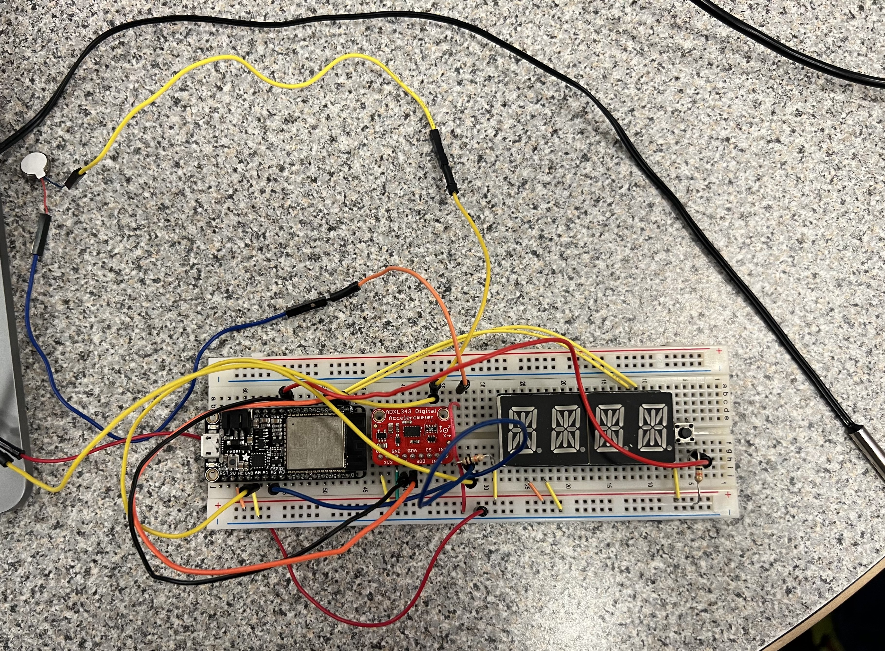

# Carmin Watch

Authors: Jake Lee, Jason Li , JiaLin Sui, Maxim Slobodchikov

Date: 2023-10-05

### Summary
The Carmin Watch is a sport watch that helps you keep track of your steps and body temperature during your activities
The key features of this watch are:
- Display real time on the display
- A button to start, stop, and reset tracking of your activity
- Reporting of your steps and body temperature every 10s and graphing it to a chart
- A buzzer alarm to alert you if you are overheating

### Self-Assessment 

| Objective Criterion | Rating | Max Value  | 
|---------------------------------------------|:-----------:|:---------:|
| Displays clock time on alpha display as HR:MIN | 1 |  1     | 
| Functions as a simple activity timer (start, stop, reset) | 1 |  1     | 
| Provides continuous reporting of steps per 10s interval to laptop | 1 |  1     | 
| Provides continuous reporting of body temperature per 10s interval to laptop | 1 |  1     | 
| Data at laptop plotted as stripcharts | 1 |  1     | 
| Provides alert function with buzzer on alarm | 1 |  1     | 

## Solution Design
In Quest 2, our goal was to create a wearable device that shows time on an alphanumeric display, measures steps, temperature, and alerts. It also provides a stopwatch function with the use of a button, and utilizes an accelerometer to track steps. 

#### Step Tracking
To track the steps we took the difference between the current and previous accelerometer and checked if the difference was greater than 0.5. This value was decided after we did some testing since when we took a step the accelerometer data difference would peak. 

#### Data Plotting
Data plotting is done through CanvasJS. The ESP32 writes sensor data to the serial port which is read by the JS file which then writes the sensor data into a csv file (for storage purposes), which is then read and updated to the nodeJS server. The nodeJS server checks for after updates to the csv file and pushes it to the sensor graphs in real-time.

#### Time Display
For time tracking we used an alphanumeric display that interfaces with the ESP32 using I2C. The time in the present is sent to the serial port from the nodeJS server once and is kept track of and incremented using the ESP32s own time tracking functionality.

#### Temperature and Buzzer
We used a thermistor to measure temperature, converted ADC values from the thermistor into Celsius values, once the Celsius values exceeded a certain set threshold (40 C) the buzzer would go off.

#### Activity Tracking
Activity tracking was done by a single button cycling between states. Upon first press the sampling process would start and sensor data would be processed and displayed. Upon second press the sampling would stop. Upon third press the data was reset. The cycle would continue to loop **start->stop->reset->start->...**

#### Dynamic Plotting of Data
To plot our data we used a nodeJS server along with the CanvasJS graphing tool to dynamically plot our data. The JS code uses ``fswatch()`` to watch for any changes to the csv file and as soon as and since the JS writes new sensor data to the csv line by line, when the csv file updates the JS will read the data and push it to the server using socket.io.

### Sketches/Diagrams

Breadboard Circuit

Getting Time

Getting Sensor Data

Graphing

### Supporting Artifacts

<i>Carmin Watch Demo Video</i>

<i>Carmin Watch Technical Video</i>

### Modules, Tools, Source Used Including Attribution
[ADXL343 Base Code](https://github.com/BU-EC444/04-Code-Examples/tree/main/i2c-accel)

[Timer Interupt Design Brief](https://github.com/BU-EC444/04-Code-Examples/tree/main/i2c-accel)

[I2C Alphanumeric Display Example](https://github.com/BU-EC444/04-Code-Examples/tree/main/i2c-display)

[Sending Data From ESP32 To Node Then CanvasJS Example](https://github.com/BU-EC444/04-Code-Examples/tree/main/serial-canvas)

[Design Patter - Interupts](https://github.com/BU-EC444/01-EBook/blob/main/docs/briefs/design-patterns/dp-interrupts.md)

